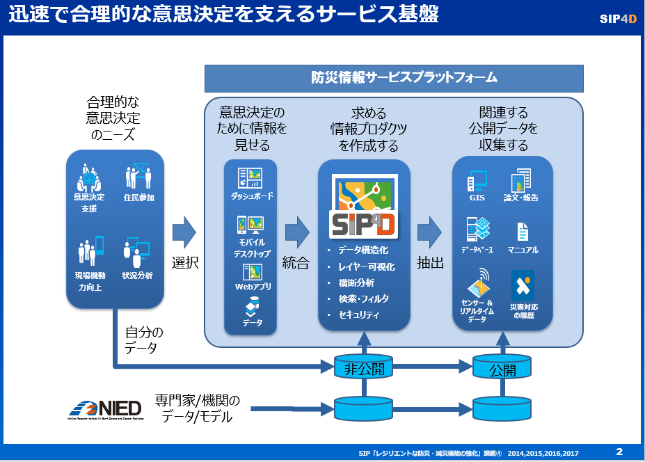

# 防災情報サービスプラットフォームについて

防災情報サービスプラットフォームは、これまで開発してきた府省庁連携防災情報共有システムのプロトタイプ（以下、SIP4Dと記す）を中心とする情報共有の枠組みを地方自治体や公的機関へと拡大し、これらの機関の効率的かつ効果的な災害対応を直接支援する情報をサービスとして提供することにより、Society 5.0 時代の災害対応の基盤となるものである。

