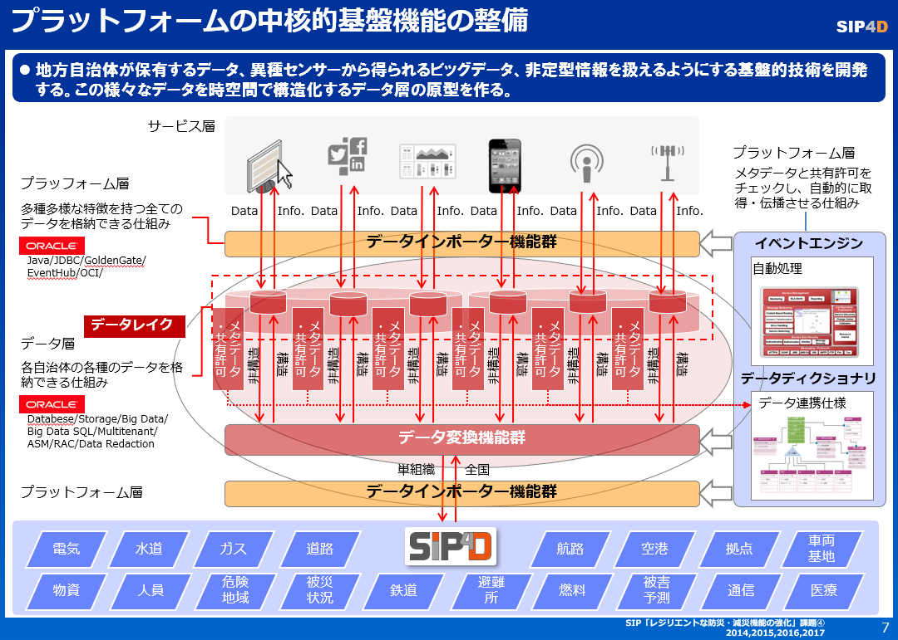

# 防災情報サービスプラットフォームの中核機能について

この図がインポート・データ層・統合環境のアーキテクチャイメージとなります。  

サービスが扱うデータや、外部データは非常に様々となるため、多様なデータは元の形式を保ったまま、どんなデータ形式でも受け入れることができるデータレイクとして蓄積する構成としています。  
センサー情報であれば、Event Hubのデータストリーミングにより、その他の形式であればGolden Gateというデータレプリケーションアプリにより、データレイクに取り込まれます。  

また、データレイクに蓄積する際に、メタデータと、共有許可をデータ接続者に明示することによってバッチ処理プログラムで、共有可能なものをメタデータの記述にしたがって照会し、結果がSIP４Dのいずれかのレイヤーに情報として統合されるしかけとなっております。このようにすることによって、フレキシブルに様々なシステムとの連携をはかること可能にしております。  

## 1.データレイクについて

データレイクとは、本プラットフォームの実ユーザーである自治体ユーザー向けに、データの形式、属性、用途にあわせた格納方法及び場所を提供する機能とする。  
[詳細](./1.Datalake/README.md)

## 2.イベントエンジンについて

イベントエンジンとは、データ変更・生成やイベントをトリガーとして、アプリケーションを動作させる自動化機能とする。  
[詳細](./2.EventEngine/README.md)

## 3.データディクショナリについて

データディクショナリとは、本プラットフォーム上のデータ（他のサービスやシステムのデータを含む全てのデータ）の形式・構造と格納場所を管理し、イベントエンジンと併せて自動処理を可能にする機能とする。  
[詳細](./3.DataDictionary/README.md)